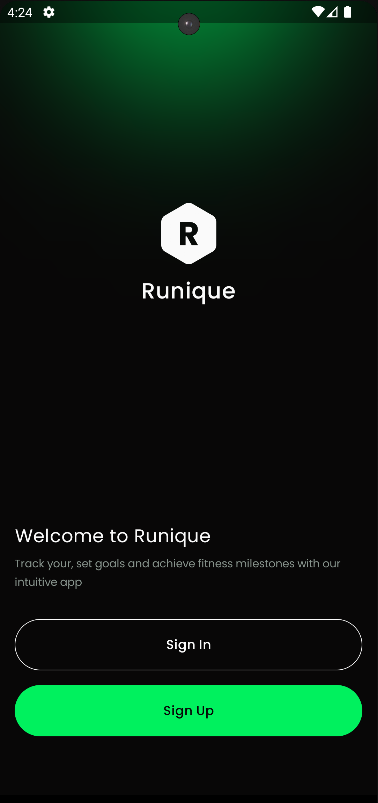
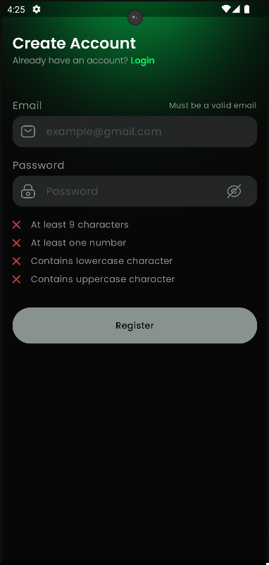
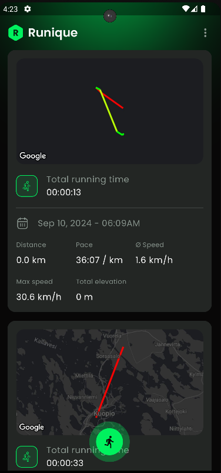
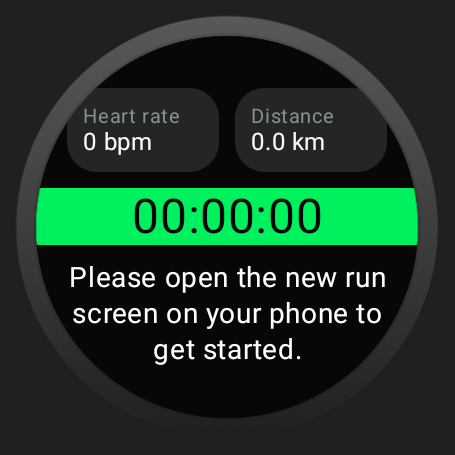
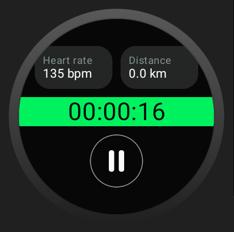
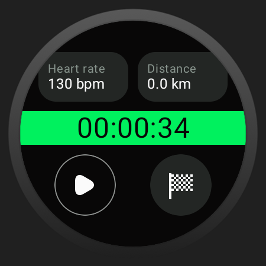

# The Essentials of Industry-Level Android App Development

### Course from Philipp Lackner

During this course I did Multi-Module Runningtracker Android application and also implemented it on a smart watch

### Pictures:

#### Start screen

#### Register screen

#### RunScreen

#### Watch default screen

#### Watch when starting a run

#### Watch when pausing a run

